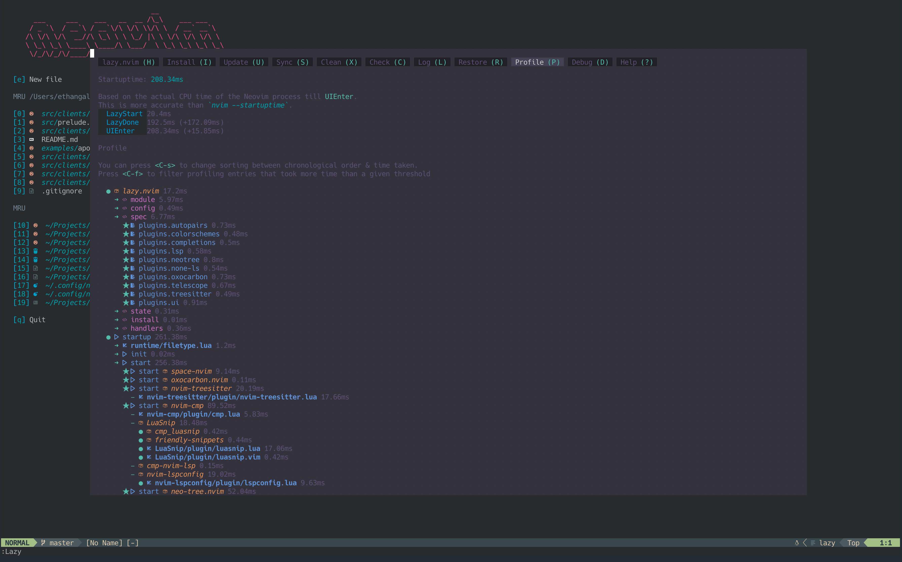
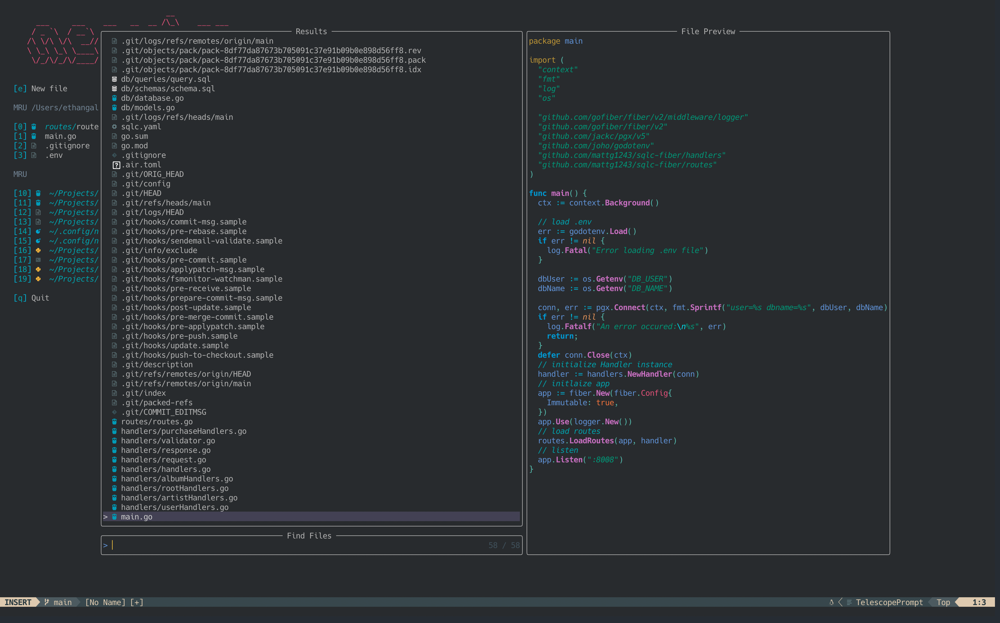
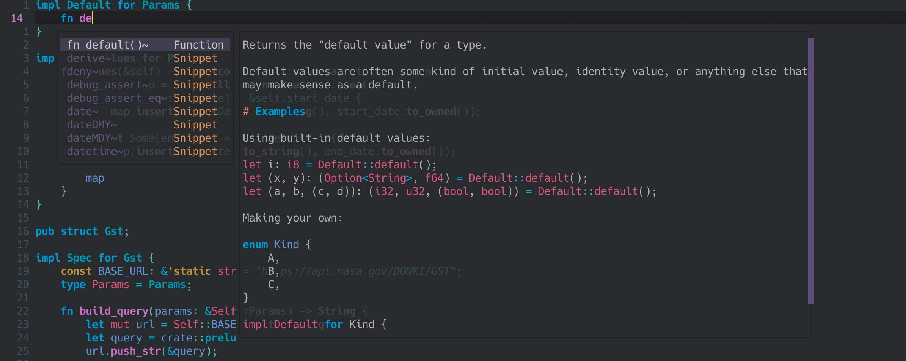

# Neovim
I've spent a while refining my neovim setup, and I finally feel like it's exactly where I want it to be. The config is easy to manage, extend, and understand, and most-importantly, both *powerful* and very *lightweight*.

I'm using [lazy.nvim](https://github.com/folke/lazy.nvim) for package management (obviously).

### Lazy Profile + Greeter
> [lazy.nvim](https://github.com/folke/lazy.nvim) profile and dashboard with [alpha.nvim](https://github.com/goolord/alpha-nvim)'s *vim-startify* theme.




### Telescope

> [telescope.nvim](https://github.com/nvim-telescope/telescope.nvim), of course.



### Completions and Code Actions

In addition to the popular `K` keybind for hover docs, and `gd` for "go to definiton" motions.

> Powerful snippets and completions for any language with a connected LSP.



> Code actions with a telescope UI.


### Language Servers
Using [mason.nvim](https://github.com/williamboman/mason.nvim) in conjuction with [mason-lspconfig.nvim](https://github.com/williamboman/mason-lspconfig.nvim) and [nvim-lspconfig](https://github.com/neovim/nvim-lspconfig) makes managing language servers a breeze.

> The [plugins/lsp.lua](https://github.com/phasewalk1/dotfiles/blob/master/nvim/lua/plugins/lsp.lua) file specifies which language servers to install.
```Lua
return {
  {
    "williamboman/mason.nvim",
    lazy = true,
    config = function()
      require("mason").setup()
    end,
  },
  {
    "williamboman/mason-lspconfig.nvim",
    lazy = false,
    config = function()
      require("mason-lspconfig").setup({
        ensure_installed = {
          "lua_ls",
          "rust_analyzer",
          "clangd",
          "biome",
          "jedi_language_server",
        },
      })
    end,
  },
  {
    "neovim/nvim-lspconfig",
    lazy = false,
    config = function()
      local config = require("lspconfig")
      config.lua_ls.setup({})
      config.rust_analyzer.setup({})
      config.clangd.setup({})
      config.biome.setup({})
      config.jedi_language_server.setup({})

      vim.keymap.set("n", "K", vim.lsp.buf.hover, {})
      vim.keymap.set("n", "gd", vim.lsp.buf.definition, {})
      vim.keymap.set("n", "<leader>ca", vim.lsp.buf.code_action, {})
    end,
  },
}
```

### Formatters and Linters
> The [plugins/none-ls.lua](https://github.com/phasewalk1/dotfiles/blob/master/nvim/lua/plugins/none-ls.lua) file specifies linters/formatters to use for each language. These can be installed using the Mason UI.
```Lua
return {
  "nvimtools/none-ls.nvim",
  lazy = false,
  config = function()
    local null_ls = require("null-ls")
    null_ls.setup({
      sources = {
        null_ls.builtins.formatting.stylua,
        null_ls.builtins.formatting.black,
        null_ls.builtins.formatting.rustfmt,
        null_ls.builtins.formatting.prettier,
        null_ls.builtins.diagnostics.eslint,
        null_ls.builtins.diagnostics.isort,
      },
    })

    vim.keymap.set("n", "<leader>gf", vim.lsp.buf.format, {})
  end,
}
```
